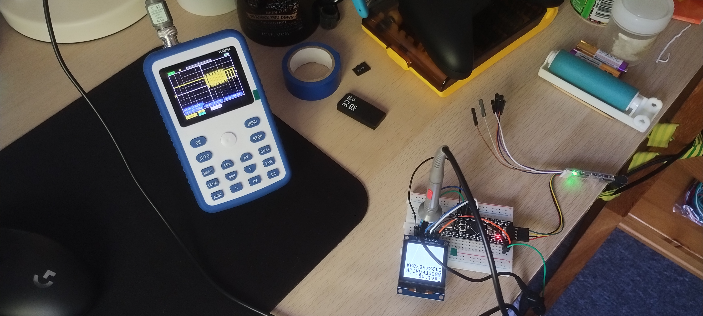

# STM32F411 Black Pill + SH1107 OLED (SPI)

This project demonstrates how to interface an **STM32F411CEU6 Black Pill** board with a **128×128 OLED display** (SH1107 driver, SPI mode).  
It uses the [ssd1306](https://github.com/afiskon/stm32-ssd1306) library to display text and graphics.

---

## Demo

  
*Display test procedure running, displayed on the SH1107 OLED via SPI.*

---

## Hardware

- **MCU:** STM32F411CEU6
- **Display:** 1.5" GME128128-01-SPI 128×128 OLED (SH1107 driver, SPI interface)  
- **Debugger/Programmer:** ST-LINK V2

---

### Pin Connections

| OLED Pin | STM32 Pin | Notes |
|----------|-----------|-------|
| VCC      | 3.3V      | OLED supply
| GND      | GND       | Ground
| SCL      | PA5       | SPI1_SCK
| SDA      | PA7       | SPI1_MOSI
| CS       | PB0       | Chip select
| DC       | PB1       | Data/Command
| RST      | PB2       | Reset

---

## Software

- **STM32CubeIDE** v1.19.0 
- **HAL drivers** (SPI, GPIO)  
- **ssd1306 library** for text/graphics rendering  

---

## Credits

- OLED driver library: [afiskon/stm32-ssd1306](https://github.com/afiskon/stm32-ssd1306)  
- STM32 HAL/LL drivers by STMicroelectronics  

---
